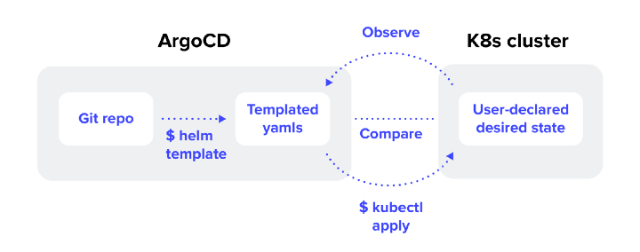
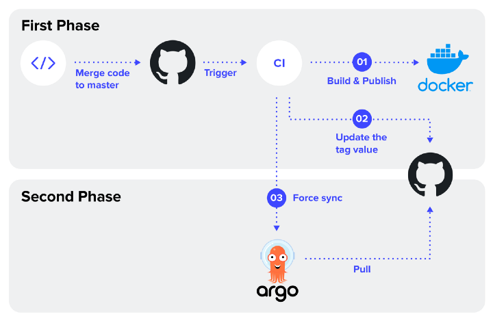
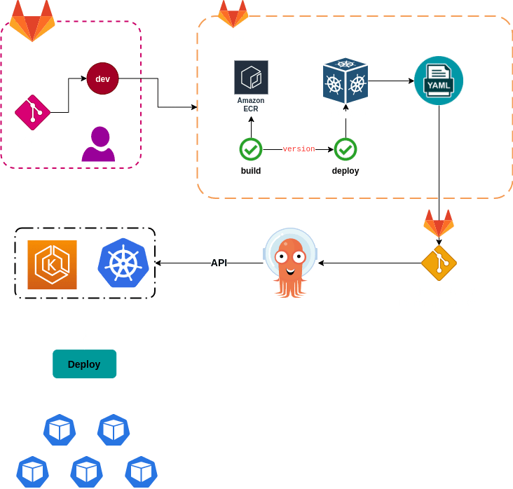
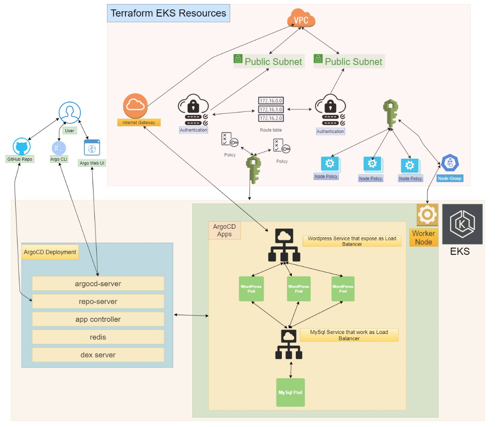

# WK9_tutorial_HA_and_K8S

## Create EKS Cluster Using AWS CLI

https://github.com/JiangRenDevOps/DevOpsNotes/blob/master/WK9_High_Availability_Scaling_K8S/homework/eks_demo.md

```
eksctl create cluster \
--name eks-cluster \
--version 1.23 \
--region us-west-2 \
--nodegroup-name linux-nodes \
--node-type t2.micro \
--nodes 3 \
--ssh-access \
--ssh-public-key <<your own key pair>> \
--managed
```

## How to Create EKS Cluster Using Terraform

https://antonputra.com/terraform/how-to-create-eks-cluster-using-terraform/

## Create EKS using Terraform module

https://antonputra.com/amazon/create-eks-cluster-using-terraform-modules/

## EKS Blueprints for Terraform Workshop - Level 400

https://catalog.workshops.aws/eks-blueprints-terraform/en-US

https://github.com/aws-samples/eks-blueprints-workloads






## Further reading
https://catalog.workshops.aws/eks-blueprints-for-cdk/en-US
